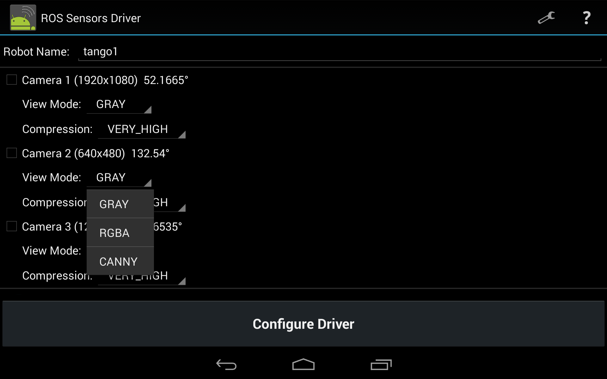
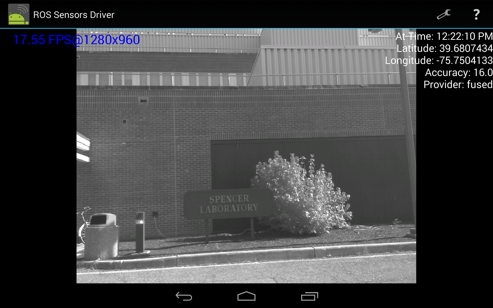
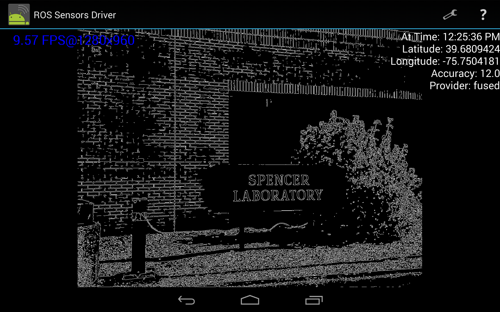

# ROS Driver for Android Sensors
```bash
git clone git@github.com:joechang0113/android-sensors-driver.git
```

## How to compile and install?

* Open `android_sensor_driver` as existing project in Android Studio
* Press run button
* Build will fail but suggest to install missing frameworks. Click on the link, install missing, and press run again.
* If u have something error like Gradle problem see [here]().
* You can choose to run on a simulator or on your phone
  * Phone
    * Your phone must have developer mode enabled.
    * Enter IP of rosmaster
  * Emulator
    * IP of localhost of emulator computer is 10.0.0.2
    * Enter 10.0.0.2 in your app in emulator, if ros is running at your local computer as well
* Please open an issue if you are unable to build
* To calibrate your camera, we recommend recording a bag and using [kalibr](https://github.com/ethz-asl/kalibr).

## Published Topics

* Camera compressed feed (if enabled) - `/android/tango1/camera_#/image/compressed`
* Camera raw feed (if no compression) - `/android/tango1/camera_#/image_raw`
* Current GPS position (fused) - `/android/tango1/fix`
* Front luminance sensor value - `/android/tango1/illuminance`
* Current device imu data (100Hz) - `/android/tango1/imu`
* Current device magnetometer data - `/android/tango1/magnetic_field`
* Current device temperature - `/android/tango1/temperature`
* Current device pressure - `/android/tango1/barometric_pressure`


## Screenshots




